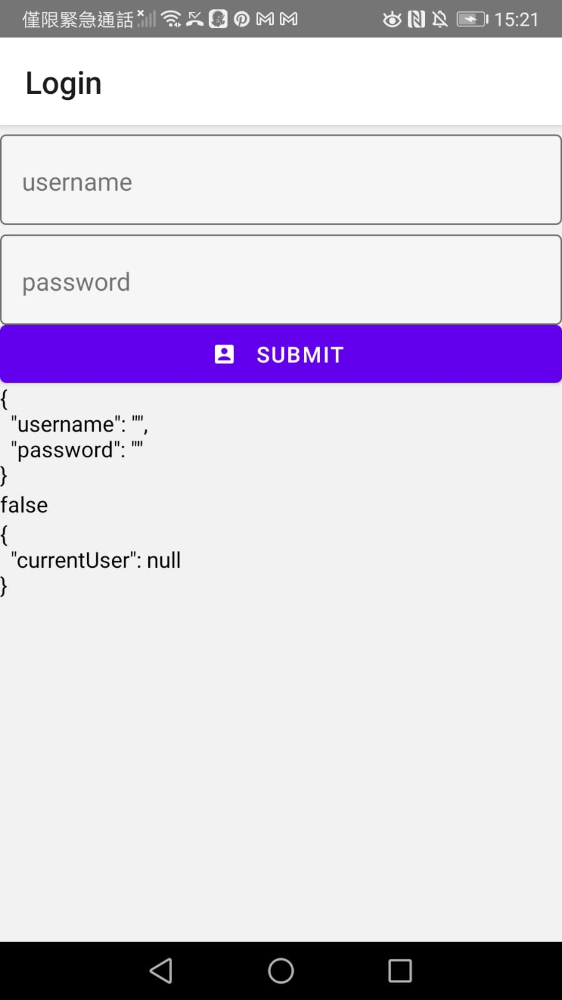
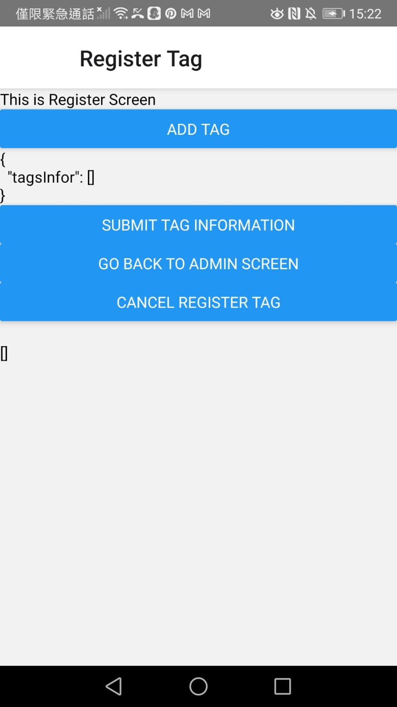

This Project includes a web app, firebase server and React native mobile app.

The core feature is to use Nfc enabled mobile phone to scan nfc tag and send the check-in time to the web app table.

Nfc Tag would have been recorded its location, so the check-in time is to prove the staff has visited the location.

Cleaners can use this technology to check-in where they have visited and clean at what time.

### Sign-in Page

### Sign-in Page after being filled

### HomePage.jpeg

### Register Tag Page.jpeg

