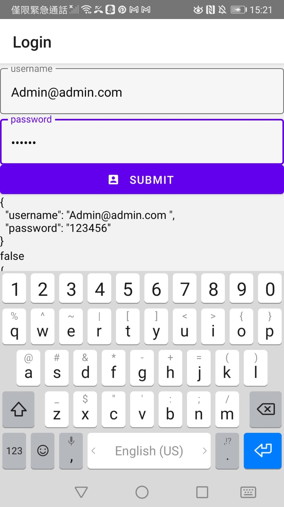
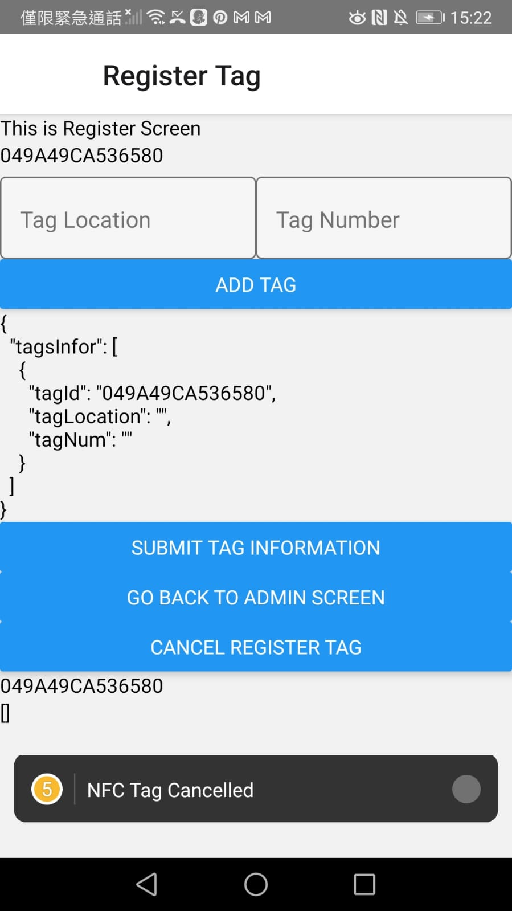
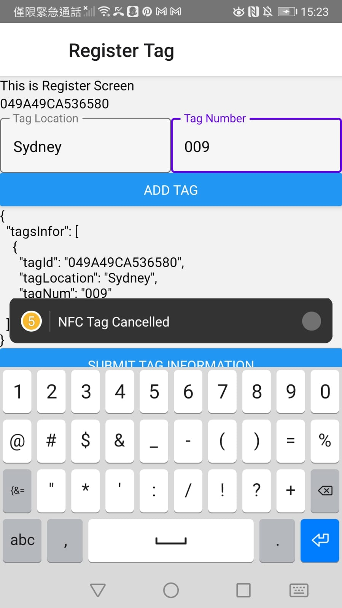
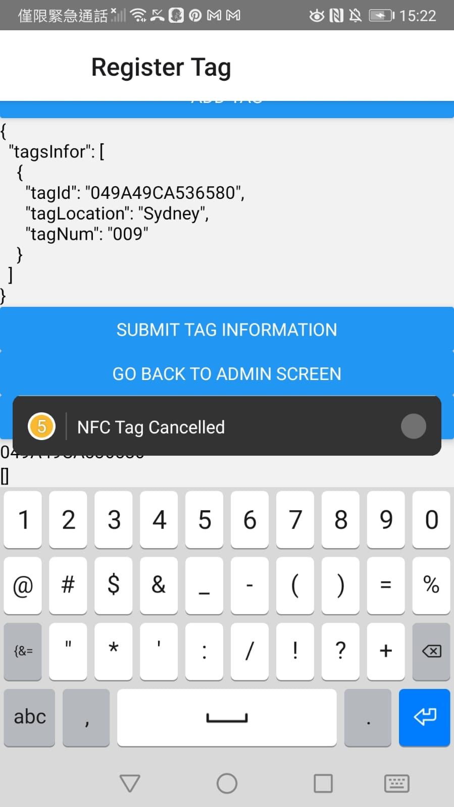
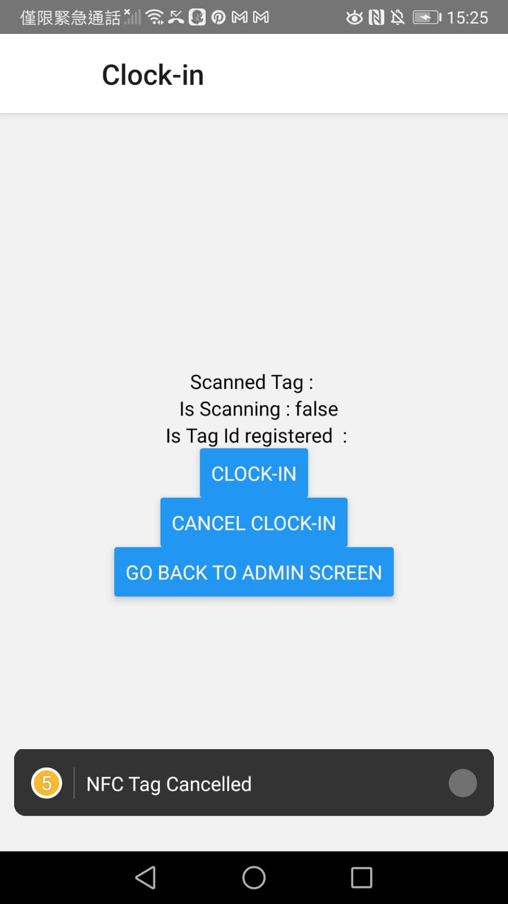

This Project includes a web app, firebase server and React native mobile app.

The core feature is to use Nfc enabled mobile phone to scan nfc tag and send the clock-in time to the web app table.

Nfc Tag would have been recorded its location, so the clock-in time is to prove the staff has visited the location.

#### Use Case #1
Cleaners can use this technology to clock-in and prove they have visited and clean at the scanned time.

### Sign-in Page

### Sign-in Page after being filled

### HomePage

### Register Tag Page

### Register Tag Page after being filled
1.

2.

3. 

### Clock In Page

